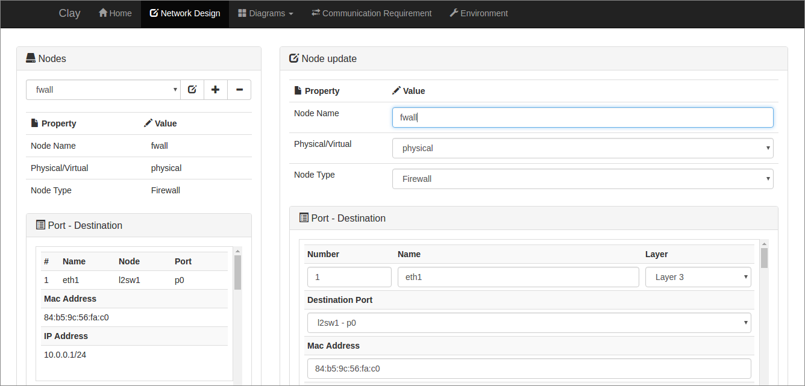

# Pottery

[](https://travis-ci.org/qb0C80aE/pottery)

Pottery is a simple GUI module works with [Loam](https://github.com/qb0C80aE/loam) on [Clay](https://github.com/qb0C80aE/clay).
It provides graphical network diagram views based on clay datastore.

### UI - network design


### UI - physial diagram from the system model store


### UI - logical diagram from the system model store


# How to build and run

```
$ # Prerequisites: glide has been installed already.
$ # Prerequisites: Clay has been cloned into $GOPATH/src/github.com/qb0C80aE/clay already.
$ cd $GOPATH/src/github.com/qb0C80aE/clay
$ # Edit: Add the '_ "github.com/qb0C80aE/loam" // Install Loam sub module by importing' line into the import section of submodules/submodules.go in Clay.
$ # Edit: Add the '_ "github.com/qb0C80aE/pottery" // Install Pottery sub module by importing' line into the import section of submodules/submodules.go in Clay.
$ glide get github.com/qb0C80aE/loam
$ glide get github.com/qb0C80aE/pottery
$ glide install
$ go generate -tags=generate ./...
$ go build
$ ./clay &
```

# How to use

## Example diagram

The diagram resource return the physical and logical diagram for [inet-henge](https://github.com/codeout/inet-henge) based on Loam data models.

```
$ curl -X GET "localhost:8080/diagrams/physical"
$ curl -X GET "localhost:8080/diagrams/logical"
```

# API Server

## Endpoint list

### Diagram Resource

```
GET    /diagrams/physical
GET    /diagrams/logical
```

# Thanks

* Pottery is using https://github.com/codeout/inet-henge to draw diagrams.
* Pottery is using http://www.quackit.com/html/templates/download/bootstrap/portal-1/ to make UI looking better.
